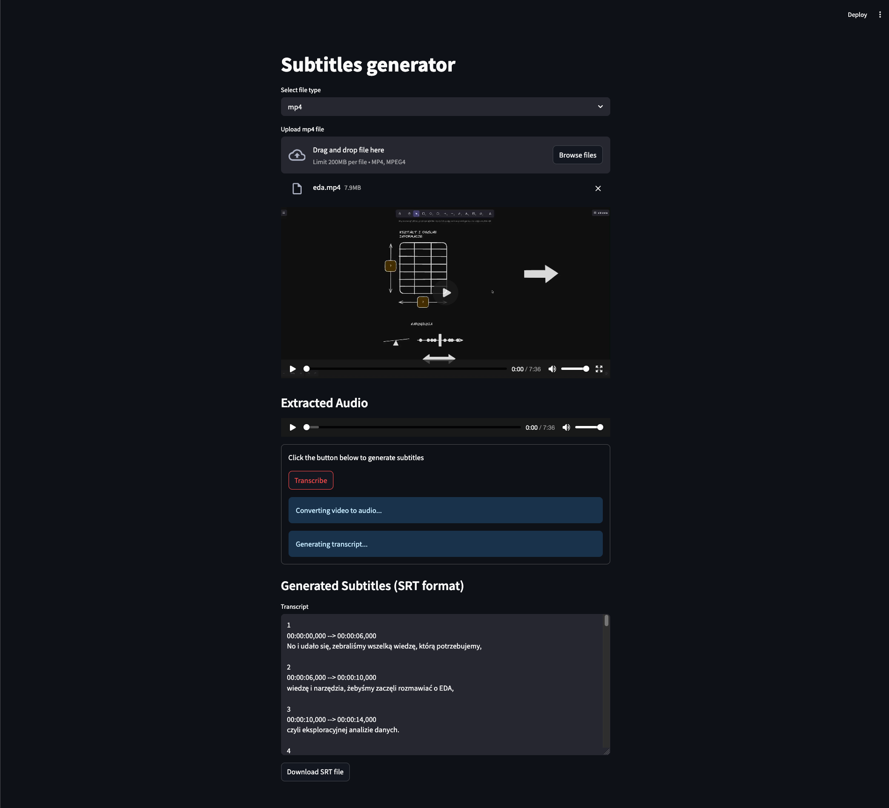

# <samp>🎬 Subtitles Generator</samp>

## 📋 About the Project

Subtitles Generator is a versatile web application built with Streamlit that automatically generates subtitles for video and audio files. The application leverages OpenAI's Whisper model for accurate speech-to-text transcription, offers multiple export formats, and allows for easy editing of generated subtitles.

## 🚀 Demo



## 🗂️ Project Structure

```
subtitles-generator/
├── app.py
├── requirements.txt
├── packages.txt
├── .env.example
├── others/
└── temp/
    ├── uploads/
    └── exports/
```

## ⚙️ Technologies

- **Frontend/Backend**: Python, Streamlit
- **Speech Recognition**: OpenAI Whisper API
- **Audio Processing**: Pydub
- **Media Handling**: FFmpeg
- **Configuration Management**: Python-dotenv
- **File Handling**: Pathlib

## 🔧 Installation and Execution

```bash
# Clone repository
git clone https://github.com/zeglicz/subtitles-generator.git
cd subtitles-generator

# Install dependencies
pip install -r requirements.txt

# FFmpeg is listed in packages.txt for Streamlit deployment
# For local development, install FFmpeg:
# For Ubuntu:
sudo apt-get install ffmpeg
# For macOS (using Homebrew):
brew install ffmpeg
# For Windows:
# Download from https://ffmpeg.org/download.html

# Configure environment variables
cp .env.example .env
# Edit the .env file and add your API keys

# Run the application
streamlit run app.py
```

## 🧠 Approach and Technical Solutions

1. **Media Upload and Processing** - handling various video and audio formats with automatic format detection and extraction of audio tracks.

2. **Speech Recognition** - integration with OpenAI's Whisper API for high-quality transcription with support for multiple languages.

3. **Subtitle Timing** - intelligent synchronization of text with audio using voice activity detection algorithms.

4. **Interactive Editing** - user-friendly interface for reviewing and editing generated subtitles.
